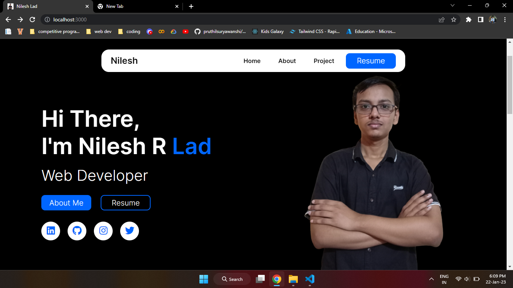

### Hi there, I'm Nilesh 👋 

## I'm a Student, Developer!!
 

## My Portfolio

 

## Holopin Board
 

 
### Connect with me:

 
  

### Coding Profile:

 
 
### Languages and Tools:

 
 

### GitHub stats:
|||
| ------------- | ------------- |

